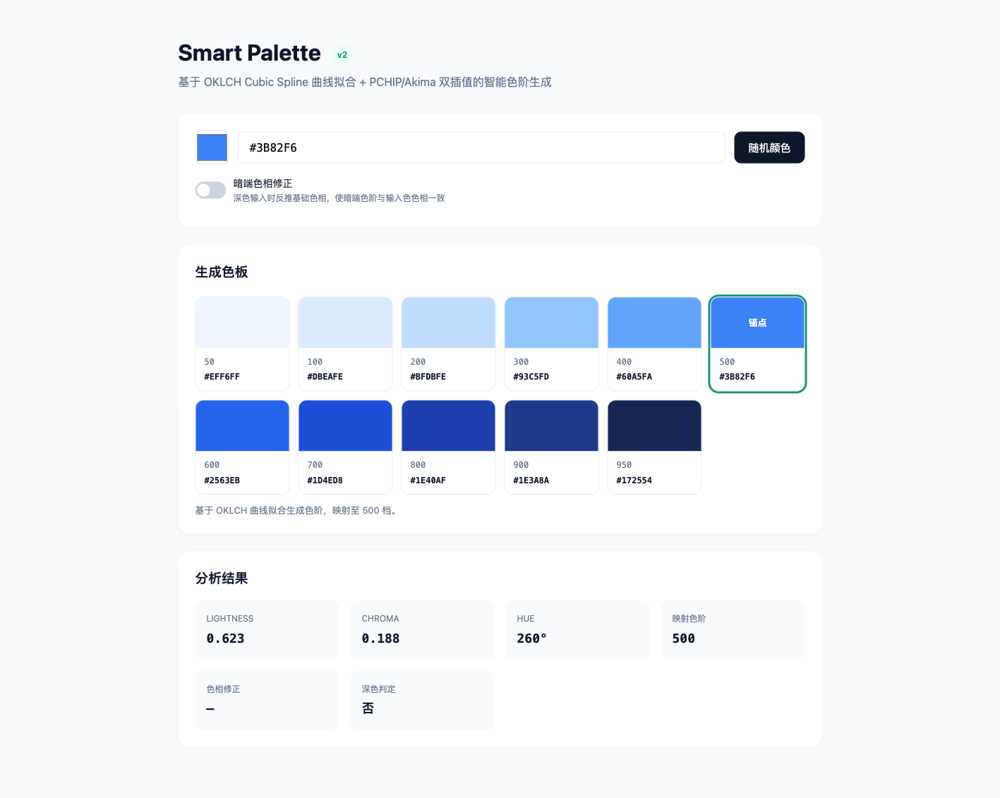
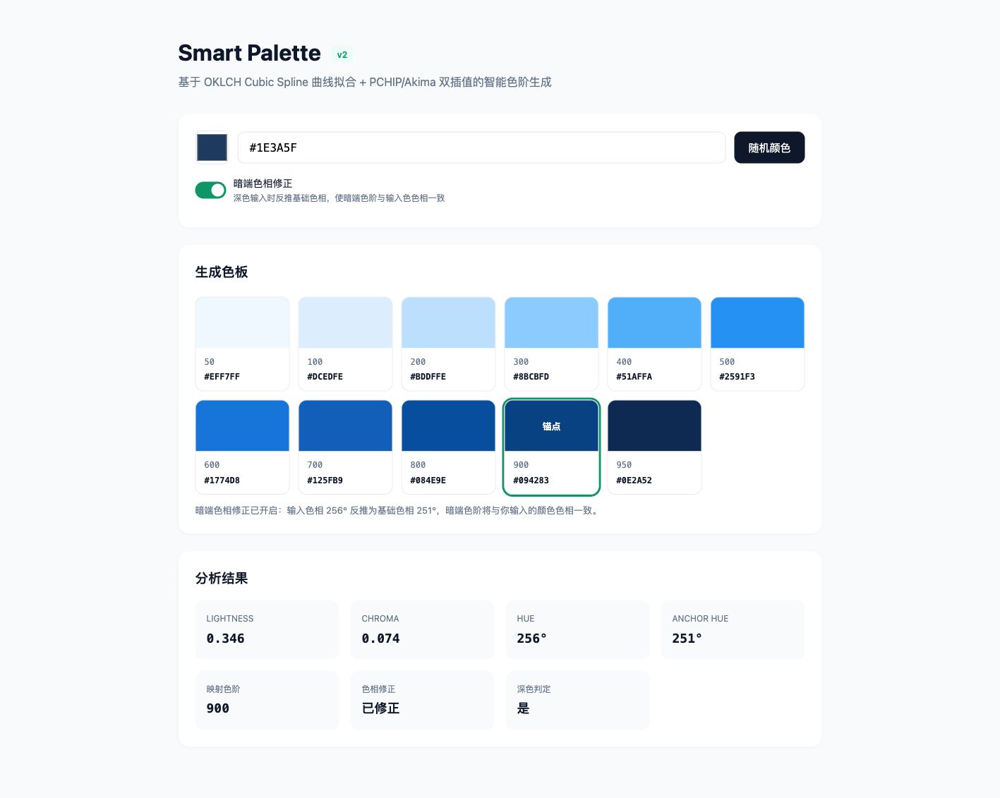

# Smart Palette

An intelligent color scale generator that uses **OKLCH Cubic Spline** curve fitting to produce perceptually uniform 11-step palettes (50–950) from any input color, anchored on Tailwind CSS v4's color data.

## Features

- **OKLCH curve fitting** — PCHIP (horizontal) + Akima (vertical) spline interpolation over 17 Tailwind v4 chromatic families, ensuring monotonicity and smooth transitions
- **Hue-aware interpolation** — Circular spline handles the 0°/360° wraparound, so palettes stay continuous across the entire hue wheel
- **sRGB gamut protection** — When OKLCH→RGB conversion falls outside sRGB, Chroma is automatically reduced while preserving Lightness and Hue
- **Dark-end hue correction** — Optional mode for dark inputs (L < 60): reverse-searches the spline to find the base hue whose dark-end tones match the input's perceived hue
- **UMD module** — Works in browsers (`<script>`), Node.js (`require`), and AMD loaders — zero dependencies

## Screenshots

### Default Mode (Light Input)



Input a color via the picker or HEX field. The algorithm fits curves across 17 Tailwind color families and generates an 11-step palette. The "锚点" (anchor) badge marks the step that best matches the input's Lightness.

### Hue Correction (Dark Input)



When a dark color is entered (L < 60), dark-end steps naturally shift hue. Enabling "暗端色相修正" reverse-searches the spline to find the base hue that makes dark-end steps consistent with the input's perceived hue. The analysis panel shows the corrected anchor hue.

## Quick Start

### Browser

```html
<script src="smart-palette.js"></script>
<script>
  // Basic usage (hue correction off by default)
  var result = SmartPalette.tv4SmartMap('#3B82F6');
  console.log(result.palette);
  // { 50: '#EFF6FF', 100: '#DBEAFE', ..., 950: '#172554' }

  // With dark-end hue correction
  var result2 = SmartPalette.tv4SmartMap('#1E3A5F', true);
  console.log(result2.hueCorrected); // true
</script>
```

### Node.js

```js
var SmartPalette = require('./smart-palette.js');

// Generate palette from HEX
var result = SmartPalette.tv4SmartMap('#3B82F6');
console.log(result.palette[500]);
console.log(result.bestStep);

// Generate OKLCH scale from hue angle
var scale = SmartPalette.generateScale(260);
console.log(scale[500]); // [62.31, 0.1880, 259.81]
```

### Legacy API

```js
// v1 smartMap interface still works (delegates to tv4SmartMap internally)
var result = SmartPalette.smartMap('#3B82F6');
console.log(result.palette);
```

## API

### `tv4SmartMap(hex, hueCorrection)`

Main entry: input any HEX color, returns full analysis + 11-step palette.

| Parameter | Type | Default | Description |
|-----------|------|---------|-------------|
| `hex` | String | — | Input color in `#RRGGBB` format |
| `hueCorrection` | Boolean | `false` | Enable dark-end hue correction |

Returns:

| Field | Type | Description |
|-------|------|-------------|
| `bestStep` | Number | Closest palette step (50/100/.../950) |
| `originalL` | Number | OKLCH Lightness of input (0–1) |
| `originalC` | Number | OKLCH Chroma of input |
| `originalH` | Number | OKLCH Hue of input (0–360) |
| `usedHue` | Number | Hue actually used (corrected or original) |
| `hueCorrected` | Boolean | Whether dark-end hue correction was applied |
| `isDark` | Boolean | Whether input is dark (L < 60) |
| `palette` | Object | 11-step palette, keys are step numbers, values are HEX |

### `generateScale(hue)`

Input a hue angle, returns 11-step OKLCH parameters (no gamut clipping).

| Parameter | Type | Description |
|-----------|------|-------------|
| `hue` | Number | Hue angle, 0–360 |

Returns: `{ 50: [L, C, h], ..., 950: [L, C, h] }` (L: 0–100, C: ≥0, h: 0–360)

### `estimateAnchorHue(inputL, inputC, inputH)`

Reverse-search the spline to find which 500-step anchor hue best matches a dark input's perceived hue.

Returns: `{ anchorHue, bestStep, error }`

### `rgbToOklch(r, g, b)` / `oklchToRgb(l, c, h)`

RGB ↔ OKLCH conversion utilities. RGB channels are normalized to 0–1.

### `oklchToRgbInGamut(l, c, h)`

Gamut-protected OKLCH→HEX conversion. When outside sRGB, Chroma is automatically reduced to preserve Lightness.

## How It Works

### Step 1: Extract Tailwind v4 Data

17 chromatic families × 11 steps = 187 OKLCH anchor points, covering Red through Rose.

### Step 2: PCHIP Horizontal Curves

For each step (e.g. 500), build a **PCHIP** spline across all 17 families' hue→L/C/h values. PCHIP guarantees monotonicity — no overshoot or undershoot at slope discontinuities (e.g. Yellow→Lime C-value jumps).

```
C values at step 500:

Natural cubic spline:  Blue(0.188) → Purple(0.232)  ← sag down to ~0.173
PCHIP:                 Blue(0.188) → Purple(0.232)  ← monotonically increasing
```

### Step 3: Akima Vertical Curves

Within each family (step→L/C/h), **Akima** splines provide smooth vertical interpolation that is insensitive to outlier slopes.

### Step 4: Circular Hue Interpolation

Hue is periodic (0° = 360°). The algorithm maps hue to cos/sin components, fits PCHIP on each, and reconstructs via atan2. Data is extended ±360° to ensure continuity at the wraparound point.

### Step 5: Palette Generation

Input a hue angle → query all 11 spline curves → get L/C/h per step → gamut-clip → output HEX palette.

### Step 6: Dark-End Hue Correction (Optional)

For dark inputs (L < 60), dark-end steps naturally drift in hue. When enabled, the algorithm searches the spline (0.5° resolution) across steps 500–950 to find the anchor hue whose dark-end predicted hue best matches the input's actual hue.

## Algorithm Comparison

| Algorithm | C-value sag | Overshoot | Character |
|-----------|-------------|-----------|-----------|
| Natural cubic | 0.0151 (7% deviation) | Yes | Oscillates at slope discontinuities |
| Akima | 0.0014 | No | Insensitive to outlier slopes, slight horizontal sag |
| **PCHIP** | **0.0000** | **0.0000** | Monotonicity guaranteed |

Final design: **PCHIP horizontal, Akima vertical**.

## Limitations

- **0.5° search resolution**: Dark-end hue correction uses 0.5° steps; edge cases may have up to 0.25° error.
- **Non-sRGB gamuts**: Colors outside sRGB are gamut-clipped by reducing Chroma; extreme colors may have slight distortion.
- **Gray families**: Slate/Gray/Zinc/Neutral/Stone are excluded from fitting (C ≈ 0); only 17 chromatic families participate.

## References

- Tailwind CSS v4 colors: https://tailwindcss.com/docs/colors
- OKLab / OKLCH color space: https://bottosson.github.io/posts/oklab/
- PCHIP: Fritsch & Carlson, "Monotone Piecewise Cubic Interpolation", SIAM J. Numer. Anal., 1980
- Akima spline: Akima, "A New Method of Interpolation and Smooth Curve Fitting Based on Local Procedures", JACM, 1970

## License

MIT
